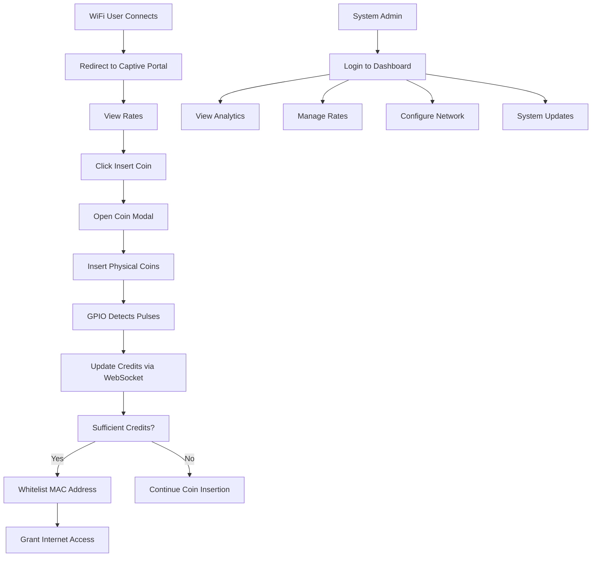

## 1. Product Overview

AJC PISOWIFI is a comprehensive coin-operated WiFi hotspot management system that transforms ordinary internet connections into paid access points. The system enables business owners to monetize their internet connection by allowing customers to purchase WiFi access time using physical coins.

The system solves the problem of providing controlled, paid internet access in public spaces while giving administrators full control over pricing, user management, and system monitoring through a web-based dashboard.

## 2. Core Features

### 2.1 User Roles

| Role | Registration Method | Core Permissions |
|------|---------------------|------------------|
| WiFi User | Automatic via MAC address | Access internet after coin payment, view rates |
| System Admin | Manual setup via admin panel | Full system control, analytics, rate management, network configuration |

### 2.2 Feature Module

Our AJC PISOWIFI system consists of the following main pages:

1. **Client Portal**: Mobile-first captive portal with rates display and coin insertion interface
2. **Admin Dashboard**: Comprehensive management interface with analytics, rates management, network configuration, and system updates
3. **Login Page**: Secure admin authentication portal

### 2.3 Page Details

| Page Name | Module Name | Feature description |
|-----------|-------------|---------------------|
| Client Portal | Rates Display | Show current pricing rates (₱1 = X minutes) with clear visual presentation |
| Client Portal | Coin Insertion Modal | Open modal with 60-second countdown timer when 'Insert Coin' clicked |
| Client Portal | Real-time Credit Update | Use WebSockets to update total credits instantly as coins are detected |
| Client Portal | Session Management | Display remaining time and connection status |
| Admin Dashboard | Analytics Overview | Show active users, daily/monthly earnings, system uptime with charts |
| Admin Dashboard | Rates Management | CRUD interface for pricing rules (coin value to time conversion) |
| Admin Dashboard | Network Interfaces | Display status of eth0, wlan0 and other network interfaces |
| Admin Dashboard | Bridge Configuration | Create network bridges and bind interfaces using Linux commands |
| Admin Dashboard | Captive Portal Control | Manage iptables rules for traffic interception and MAC whitelisting |
| Admin Dashboard | System Updater | GitHub-based update system with real-time terminal output streaming |
| Login Page | Admin Authentication | Secure login form with session management |

## 3. Core Process

**User Flow:**
1. User connects to WiFi and gets redirected to captive portal
2. User views pricing rates on the portal
3. User clicks "Insert Coin" button
4. Coin modal opens with 60-second countdown
5. User inserts physical coins into coin slot
6. System detects coin pulses via GPIO and updates credits in real-time
7. Upon sufficient credits, system whitelists user's MAC address
8. User gains internet access for purchased time duration

**Admin Flow:**
1. Admin logs into secure dashboard
2. Views system analytics and active users
3. Manages pricing rates through CRUD interface
4. Configures network interfaces and bridges
5. Monitors system status and performs updates

## 4. User Interface Design

### 4.1 Design Style
- **Primary Colors**: Blue (#3B82F6) for primary actions, Green (#10B981) for success states
- **Secondary Colors**: Gray (#6B7280) for secondary elements, Red (#EF4444) for errors
- **Button Style**: Rounded corners with subtle shadows, hover effects for interactivity
- **Typography**: Sans-serif fonts (Inter or system fonts), 16px base size with clear hierarchy
- **Layout**: Card-based design with proper spacing, mobile-first responsive approach
- **Icons**: Clean line icons for better mobile visibility and touch targets

### 4.2 Page Design Overview

| Page Name | Module Name | UI Elements |
|-------------|---------------|---------------|
| Client Portal | Main Interface | Mobile-first layout with large touch-friendly buttons, rates displayed in card format with clear pricing, prominent "Insert Coin" button with coin icon |
| Client Portal | Coin Modal | Centered modal with large countdown timer (60s), real-time credit display with animated updates, progress bar for visual feedback |
| Admin Dashboard | Analytics Cards | Grid layout with metric cards showing key statistics, line charts for earnings trends, status indicators with color coding |
| Admin Dashboard | Configuration Forms | Clean form inputs with labels, action buttons with proper spacing, validation feedback |

### 4.3 Responsiveness
- **Mobile-first approach**: Designed primarily for mobile devices since WiFi users will mainly use phones
- **Touch optimization**: Large buttons (minimum 44px), proper spacing between interactive elements
- **Adaptive layout**: Responsive grid system that works on tablets and desktop for admin dashboard
- **Progressive enhancement**: Core functionality works on basic browsers, enhanced experience on modern devices

### 4.4 Hardware Integration Notes
- **GPIO Interface**: Physical pin 3 for coin detection with debouncing logic
- **Real-time Updates**: WebSocket integration for instant credit updates as coins are inserted
- **Hardware Abstraction**: Support for both Raspberry Pi and Orange Pi platforms
- **Error Handling**: Graceful degradation if hardware is not available during development