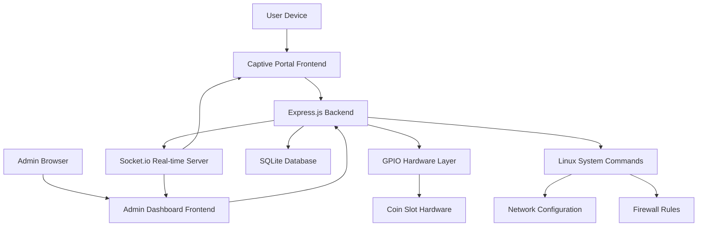
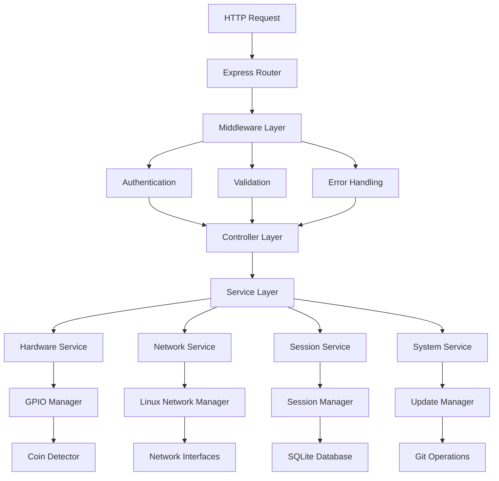
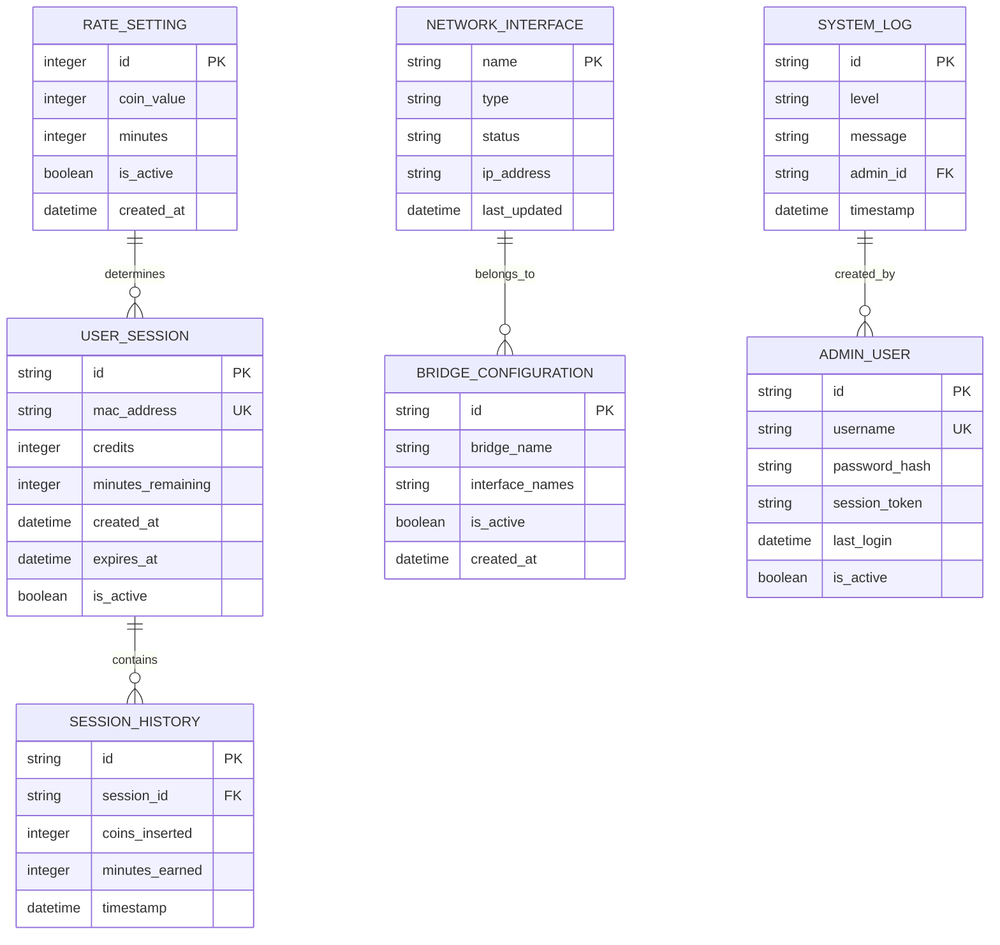

## 1. Architecture Design



## 2. Technology Description

- **Frontend**: Pure JavaScript ES6+ with Tailwind CSS
- **Backend**: Node.js@18 + Express.js@4 + Socket.io@4
- **Database**: SQLite3 with better-sqlite3 driver
- **Hardware**: GPIO abstraction layer for Raspberry Pi/Orange Pi
- **System Integration**: child_process for Linux command execution
- **Real-time Communication**: Socket.io for live updates

## 3. Route Definitions

| Route | Purpose |
|-------|---------|
| / | Client captive portal landing page |
| /api/credits | Get current credits and rates |
| /api/session | Create and manage user sessions |
| /admin | Admin dashboard login page |
| /admin/dashboard | Main admin dashboard with analytics |
| /admin/rates | Rate management interface |
| /admin/network | Network configuration page |
| /admin/updater | System update management |
| /api/admin/auth | Admin authentication endpoints |
| /api/admin/analytics | Analytics data API |
| /api/admin/rates | CRUD operations for rates |
| /api/admin/network | Network interface management |
| /api/admin/system | System control and updates |

## 4. API Definitions

### 4.1 Client API Endpoints

**Get Current Rates**
```
GET /api/rates
```

Response:
```json
{
  "rates": [
    {"coin": 1, "minutes": 10},
    {"coin": 5, "minutes": 60},
    {"coin": 10, "minutes": 150}
  ]
}
```

**Create Session**
```
POST /api/session
```

Request:
```json
{
  "mac_address": "aa:bb:cc:dd:ee:ff",
  "credits": 5
}
```

Response:
```json
{
  "session_id": "uuid",
  "minutes_remaining": 60,
  "expires_at": "2026-01-17T12:00:00Z"
}
```

### 4.2 Admin API Endpoints

**Admin Login**
```
POST /api/admin/auth/login
```

Request:
```json
{
  "username": "admin",
  "password": "secure_password"
}
```

**Get Analytics**
```
GET /api/admin/analytics
```

Response:
```json
{
  "active_users": 5,
  "daily_earnings": 125,
  "monthly_earnings": 3450,
  "system_uptime": "72:30:15"
}
```

**Update Rates**
```
PUT /api/admin/rates/:id
```

Request:
```json
{
  "coin_value": 1,
  "minutes": 15
}
```

**System Update**
```
POST /api/admin/system/update
```

Request:
```json
{
  "repository_url": "https://github.com/user/repo",
  "branch": "main"
}
```

## 5. Server Architecture Diagram



## 6. Data Model

### 6.1 Data Model Definition



### 6.2 Data Definition Language

**User Sessions Table**
```sql
CREATE TABLE user_sessions (
    id TEXT PRIMARY KEY,
    mac_address TEXT UNIQUE NOT NULL,
    credits INTEGER DEFAULT 0,
    minutes_remaining INTEGER DEFAULT 0,
    created_at DATETIME DEFAULT CURRENT_TIMESTAMP,
    expires_at DATETIME,
    is_active BOOLEAN DEFAULT TRUE
);

CREATE INDEX idx_sessions_mac ON user_sessions(mac_address);
CREATE INDEX idx_sessions_active ON user_sessions(is_active);
CREATE INDEX idx_sessions_expires ON user_sessions(expires_at);
```

**Session History Table**
```sql
CREATE TABLE session_history (
    id TEXT PRIMARY KEY,
    session_id TEXT NOT NULL,
    coins_inserted INTEGER NOT NULL,
    minutes_earned INTEGER NOT NULL,
    timestamp DATETIME DEFAULT CURRENT_TIMESTAMP,
    FOREIGN KEY (session_id) REFERENCES user_sessions(id)
);

CREATE INDEX idx_history_session ON session_history(session_id);
CREATE INDEX idx_history_timestamp ON session_history(timestamp);
```

**Rate Settings Table**
```sql
CREATE TABLE rate_settings (
    id INTEGER PRIMARY KEY AUTOINCREMENT,
    coin_value INTEGER NOT NULL,
    minutes INTEGER NOT NULL,
    is_active BOOLEAN DEFAULT TRUE,
    created_at DATETIME DEFAULT CURRENT_TIMESTAMP
);

INSERT INTO rate_settings (coin_value, minutes) VALUES (1, 10);
INSERT INTO rate_settings (coin_value, minutes) VALUES (5, 60);
INSERT INTO rate_settings (coin_value, minutes) VALUES (10, 150);
```

**Network Interfaces Table**
```sql
CREATE TABLE network_interfaces (
    name TEXT PRIMARY KEY,
    type TEXT NOT NULL,
    status TEXT DEFAULT 'unknown',
    ip_address TEXT,
    last_updated DATETIME DEFAULT CURRENT_TIMESTAMP
);
```

**Admin Users Table**
```sql
CREATE TABLE admin_users (
    id TEXT PRIMARY KEY,
    username TEXT UNIQUE NOT NULL,
    password_hash TEXT NOT NULL,
    session_token TEXT,
    last_login DATETIME,
    is_active BOOLEAN DEFAULT TRUE
);

-- Default admin user (password: admin123)
INSERT INTO admin_users (id, username, password_hash) VALUES 
('admin-uuid', 'admin', '$2b$10$YourHashedPasswordHere');
```

**System Logs Table**
```sql
CREATE TABLE system_logs (
    id TEXT PRIMARY KEY,
    level TEXT NOT NULL,
    message TEXT NOT NULL,
    admin_id TEXT,
    timestamp DATETIME DEFAULT CURRENT_TIMESTAMP,
    FOREIGN KEY (admin_id) REFERENCES admin_users(id)
);

CREATE INDEX idx_logs_level ON system_logs(level);
CREATE INDEX idx_logs_timestamp ON system_logs(timestamp);
```

## 7. Hardware Integration Layer

### 7.1 GPIO Configuration
- **Default Pin**: Physical Pin 3 (GPIO2)
- **Pulse Detection**: Rising edge trigger with debouncing
- **Coin Values**: 1 pulse = ₱1, 5 pulses = ₱5, 10 pulses = ₱10
- **Board Support**: Automatic detection of Raspberry Pi vs Orange Pi

### 7.2 Hardware Abstraction
```javascript
class HardwareManager {
    detectBoard() // Auto-detect Raspberry Pi or Orange Pi
    initializeGPIO(pin) // Setup GPIO input with pull-down
    onCoinPulse(callback) // Register coin detection handler
    cleanup() // Proper GPIO cleanup on shutdown
}
```

## 8. Security Implementation

### 8.1 Authentication
- **Admin Sessions**: JWT-based with secure session storage
- **Session Timeout**: 30 minutes of inactivity
- **Password Requirements**: Minimum 8 characters, complexity rules

### 8.2 Network Security
- **MAC Address Validation**: Format validation and spoofing detection
- **Rate Limiting**: API endpoint protection against abuse
- **Input Sanitization**: All user inputs validated and sanitized

### 8.3 System Security
- **Command Injection Prevention**: All system commands properly escaped
- **File System Protection**: Restricted file access permissions
- **Error Handling**: No sensitive information in error messages